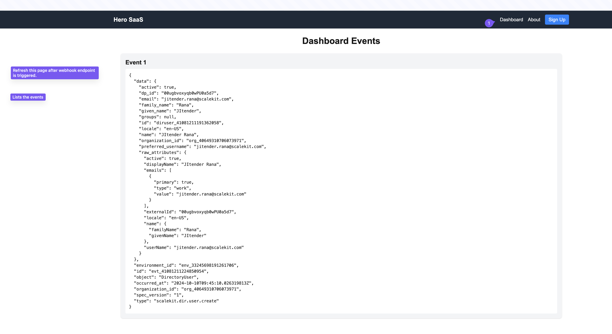

# Webhook Sample App (Next.js)

## Overview

This sample Next.js application demonstrates how to use Webhooks to register and listen for events from ScaleKit. It specifically focuses on handling the `scalekit.dir.user.create` event type.



## Features

- Webhook endpoint registration
- Event listening for ScaleKit events
- Handling of `scalekit.dir.user.create` events

## Prerequisites

- ScaleKit account (currently in Closed Beta) - [Request Invite](mailto:saif@scalekit.com)
- Node.js and npm installed
- ngrok for exposing local server to the internet

## Installation

1. Clone the repository:

2. Navigate to the project directory: `scalekit-webhook-sample-app`

3. Install dependencies: `npm install`

## Usage

1. Start the development server: `npm run dev`
2. Expose the local server to the internet using ngrok: `ngrok http 3000`
3. Update the webhook URL in the ScaleKit Dashboard:

- Go to Dashboard > Webhooks > + Add Webhook
- Set the URL to your ngrok URL (e.g., `https://abc123.ngrok-free.app/api/webhook/user-access`)

4. Test the webhook:

- Use the "Test" button in the ScaleKit Dashboard, or
- Assign a user to a group in your directory

## Supported Event Types

ScaleKit supports the following event types:

- `scalekit.dir.sync.enable`
- `scalekit.dir.sync.disable`
- `scalekit.dir.user.create`
- `scalekit.dir.user.update`
- `scalekit.dir.user.delete`
- `scalekit.dir.group.create`
- `scalekit.dir.group.update`
- `scalekit.dir.group.delete`

For a complete reference of event types, see the [Webhooks Reference](https://dub.sh/staging-webhooks-reference).

## Example Event

Here's an example of a `scalekit.dir.user.create` event:

```json
{
  "data": {
    "active": true,
    "dp_id": "00uxyz123abcdefg4567",
    "email": "john.doe@example.com",
    "family_name": "Doe",
    "given_name": "John",
    "groups": null,
    "id": "diruser_98765432109876543",
    "locale": "en-US",
    "name": "John Doe",
    "organization_id": "org_12345678901234567",
    "preferred_username": "john.doe@example.com",
    "raw_attributes": {
      "active": true,
      "displayName": "John Doe",
      "emails": ["john.doe@example.com", "johnd@company.com"],
      "externalId": "00uxyz123abcdefg4567",
      "locale": "en-US",
      "name": {
        "givenName": "John",
        "familyName": "Doe",
        "middleName": "Michael"
      },
      "userName": "john.doe@example.com"
    }
  },
  "environment_id": "env_98765432109876543",
  "id": "evt_12345678901234567",
  "object": "DirectoryUser",
  "occurred_at": "2023-04-15T14:30:45.123456789Z",
  "organization_id": "org_12345678901234567",
  "spec_version": "1",
  "type": "scalekit.dir.user.create"
}
```

For more information on implementing SCIM provisioning with ScaleKit, please visit our Directory Sync Quickstart Guide.

For access to the Closed Beta or any questions, please contact saif@scalekit.com.
